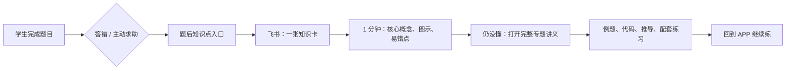

# 题目知识点与飞书资料联动方案

> 目标：让学生做完一道不会的题后，先快速理解“这题到底卡在哪里”，再按需进入完整讲义；资料更新无需重新发布客户端。

## 1. 你的设想，整理成一条学生路径

不是只做“每节课一份讲义”，而是把现有课程、补充讲义、知识卡和题库连成一张可复用的知识网：



题目页不自动跳外部页面，也不在客户端塞入整份讲义。学生点击“没懂？看知识点”后才打开飞书卡片；飞书卡片底部再放“深入学习”链接，进入对应专题讲义。这样做题不断流，基础薄弱的孩子也不会一上来被长文淹没。

## 2. 已有资源可以怎样复用

`/Users/hanliuliu/Desktop/学生成长计划/教学资料/CSP集训初赛补充物料` 已具备这套体系的主体，不需要从零生图：

| 资源 | 已有内容 | 新体系中的位置 |
|---|---|---|
| 21 份 DOCX 专题讲义 | 正文、例题、代码、图表，覆盖位运算、数论、栈队列、树图、复杂度、递归、贪心、二分、DP、计算机基础等 | 第二层：完整专题讲义 |
| `csp初赛重点知识卡片.xlsx` | 21 张竖版知识卡图片，约 40MB | 第一层：飞书知识卡主图 |
| P1-P71 课程与寓言资料 | 按课时组织的入门学习线 | 课程入口、故事化类比、前置知识补充 |
| 1023 道统一题库 | 已有大类 `knowledgePoint` | 题目入口和映射目标 |

已核实知识卡的风格非常适合中小学生：画面明亮、图文分区明确、代码和图示并存。例如二进制、洪水填充、初等数论、二分答案、递归复杂度已经可以直接作为飞书第一层内容。它们不应打进客户端安装包，应该上传/嵌入飞书文档。

## 3. 内容层级：卡片负责“先懂”，讲义负责“学透”

### 第一层：飞书知识卡（1-3 分钟）

一张知识卡只回答五件事：

1. 这是什么。
2. 这题为什么要用它。
3. 一条口诀或判断流程。
4. 一个极小示例或图示。
5. 最常见的一个坑。

卡片文档的固定底部链接：

- `深入学习：完整专题讲义`
- `回到练习：APP 内对应训练入口`（第一期可只保留文字提示，不必做深链）
- `相关知识：前置知识 / 易混知识`

### 第二层：飞书专题讲义（10-25 分钟）

由 DOCX 清理后迁入飞书，保留定义、推导、完整代码、例题、历年题、配套练习。不要把所有 DOCX 原样堆上去：去除机构、公司、内部教学、联系方式、二维码等信息后再公开。

### 第三层：课程与寓言（可选）

对 C++ 初学者，知识卡中可增加“先补前置课”链接，例如：

- 位运算卡 → P35-P39 进制、补码与位运算课程。
- 二分卡 → P66 二分查找课程。
- 栈表达式卡 → P69 栈课程。

寓言只用于帮助建立直觉，不替代定义、代码边界或真题训练。

## 4. 题库怎样绑定，避免把题库改成一团

目前的 `knowledgePoint` 是大类标签，适合筛选，不够精确讲解。例如“控制结构”有 183 道题，“数据类型与运算”有 187 道题。因此采用两个独立数据层：

```text
unified-quiz-bank.json                  题目原始内容，保留既有 knowledgePoint
knowledge-points.json                   知识点目录、卡片和讲义资源 ID
question-knowledge-mapping.json         题目 ID -> 主知识点 + 0~2 个辅助知识点
learning-resources.json                 已有的学习资料入口，继续承载课程讲义/寓言等
```

建议字段：

```json
// public/course-data/knowledge-points.json
{
  "version": 1,
  "items": [
    {
      "id": "binary-and-bitwise",
      "name": "二进制与位运算",
      "stage": "C2",
      "summary": "用二进制表示信息，掌握位运算和常见转换。",
      "cardResourceId": "kp-binary-and-bitwise-card",
      "lectureResourceId": "kp-binary-and-bitwise-lecture",
      "prerequisiteIds": ["integer-data-types"],
      "relatedLessonIds": [35, 36, 38, 39],
      "isClassCodeRequired": false
    }
  ]
}

// public/course-data/question-knowledge-mapping.json
{
  "version": 1,
  "mappings": {
    "gesp-2026-06-2-04": {
      "primary": "operator-precedence",
      "secondary": ["integer-division-and-modulo"]
    }
  }
}
```

规则：每题只能有 1 个 `primary`，最多 2 个 `secondary`。题后默认只展示主知识点，避免让孩子面对一排“可能相关”的入口；辅助知识点放在飞书卡片里的“还可能卡在这里”。

不建议把飞书长 URL、整段讲义、图片 Base64 写进 1023 道题里。资源通过稳定 ID 关联，后续飞书链接、图片或说明有调整时，只改目录即可。

## 5. 首批知识点包：先覆盖高频、可直接复用的 21 个主题

这批补充物料天然适合形成首批专题包。优先顺序按“题库覆盖面 + 中小学生常见卡点 + 已有卡图成熟度”排：

| 批次 | 专题 | 资料状态 | 推荐用途 |
|---|---|---|---|
| A | 二进制与位运算、初等数论、数据类型与存储单位、数组链表、栈队列、表达式求值、二叉树、图、复杂度 | 已有讲义，部分已有知识卡图 | 真题阅读与基础概念高频救援 |
| B | 递归复杂度、洪水填充、贪心、二分边界、二分答案、编码解码 | 已有讲义，部分已有知识卡图 | 进阶算法与专项练习救援 |
| C | 动态规划、网络发展、计算机发展史、计算机语言 | 已有讲义 | 拓展与计算机基础；不要抢占基础语法的首屏优先级 |

第一期只把 A 批 8 个高频主题做成完整闭环：`知识卡 → 专题讲义 → 题目映射 → 题后入口`。包括：二进制与位运算、初等数论、数据类型与存储单位、栈与队列、表达式求值、树、图、复杂度。

原因：它们已有图文基础，且能覆盖计算机基础、数据类型与运算、进制与编码、线性结构、树图、复杂度等多个现有题库大类。完成质量比一口气覆盖 1023 道题更重要。

## 6. 飞书信息架构与权限

飞书资料库必须首先是一套**孩子直接打开就能学的公开资料库**，不是依赖桌宠才能使用的附件。桌宠、老师转发链接、家长收藏链接，访问的是同一批文档；区别只在于桌宠能根据错题把孩子带到最恰当的知识点。

建立一个长期不变的总入口文档：`智子学习资料库｜CSP 学习导航`。这是学生、家长、老师统一保存和转发的总链接。它不是把全部图片堆在一页，而是明确的导航页：

```text
智子学习资料库｜CSP 学习导航（总链接，互联网只读）
├── 00 从这里开始
│   ├── 学习路线：零基础 / 一轮复习 / 冲刺
│   └── 如何使用：课程学习、错题救援、真题复盘
├── 01 CSP-J 初赛
│   ├── 课程线：C1 入门（P1-P25）
│   ├── 课程线：C2 基础（P26-P50）
│   ├── 课程线：C3 进阶（P51-P71）
│   ├── 真题知识点救援
│   │   ├── 进制与位运算 / 数论与数学 / 程序阅读与复杂度
│   │   ├── 数据结构 / 搜索、二分与贪心 / 计算机基础
│   └── 寓言与记忆卡
├── 02 CSP-J 复赛（预留，不与初赛内容混排）
│   ├── 算法基础与代码实现
│   ├── 数据结构与搜索
│   ├── 动态规划与图论
│   ├── 专题训练与复盘
│   └── 讲题与拓展资料
└── 03 班级专属资料（需班级码）
    ├── 周练、模考、班级挑战
    └── 活动 Boss、限定奖励、赛季资料
```

每一份资料都要有自己的可公开直读链接，而非只在总文档里“占一个位置”：

1. `知识卡｜二进制与位运算`：主图 + 1 分钟摘要 + 讲义链接。
2. `专题讲义｜二进制与位运算`：由 DOCX 清理整理而成的完整内容。
3. `课程讲义｜P35-P39 进制与位运算`：按课时组织的系统学习入口，链接相关知识卡、寓言和练习。

文档顶部固定放面包屑导航，例如：`智子学习资料库 > CSP-J 初赛 > 真题知识点救援 > 二进制与位运算`，并提供“返回总导航”和相邻主题链接。孩子从任何一份转发来的资料进入，都不会迷路。

权限沿用既定策略：总导航、初赛课程、基础知识卡与基础讲义均设置为“互联网获得链接的人可阅读”，不要求先安装桌宠或登录飞书；周练、模考、班级挑战、活动 Boss、限定奖励、班级专属任务保留班级码门禁。飞书侧关闭复制、下载、协作者管理；编辑权限仅保留给你。

## 7. 客户端交互，不重复做一套“讲义中心”

保留现有 `/resources` 作为桌宠内的主动浏览入口；它与飞书总导航指向同一套资源。新增的是题后轻入口，不新建第二个资料中心。

题目提交后：

- 答错：在解析下方显示一个主按钮 `没懂？看「二进制与位运算」`。
- 答对但想巩固：显示较轻的文字入口 `巩固这个知识点`。
- 未建立映射：不显示空按钮，保留现有解析，后台记录待补映射。
- 进入资源时：直接打开对应飞书知识卡；孩子要深入时再点讲义里的链接。即使不从桌宠进入，直接打开该飞书链接也必须能完整阅读。

学习资料页中，课程讲义、寓言、复盘仍按现有资源卡展示。知识卡不必全部同时出现在首页；可增加一个 `真题知识点` 筛选，或在相关课程资源里展示“关联真题知识卡”。

## 8. 内容清理和质量要求

DOCX 上飞书前必须做以下审核：

- 删除公司、机构、教师个人联系方式、二维码、收费或内部班级信息。
- 核对 C++ 代码、公式、答案与近年考试规则；不要把过时结论直接公开。
- 每张知识卡只承载一个主题；代码以截图或等宽代码块呈现，不让 AI 生图生成长代码。
- 图卡文字必须人工审校，尤其是“取模/取余”“边界”“复杂度”“补码”等容易造成误解的部分。
- 算法主题标明适用层级：`CSP-J 必备`、`CSP-J 拓展` 或 `后续进阶`，避免基础学生被 DP、贪心等内容劝退。

## 9. 资源、成本与发版边界

- 21 张现有卡片原图约 40MB，只放飞书，不进入客户端、Gitee 或安装包。
- 飞书文档更新后学生下次点击即可看到新内容，不要求重新下载安装包。
- 客户端只新增轻量 JSON 映射和一个题后按钮，数据量预计远小于 100KB。
- 现有图片已经可以覆盖首批知识点；新生图仅补三种情况：缺少图示的抽象概念、寓言场景、试炼场封面。不要为每一道题单独生图。
- 使用远程索引时，把 `REMOTE_RESOURCE_INDEX_URL` 配为自己的 Cloudflare 静态 JSON；客户端远程加载失败时继续回退本地索引。飞书文档 URL 变化只需改远程 JSON。

## 10. 分期实施与验收

### 第 0 期：资料准备（不改客户端）

1. 为 21 张现有知识卡建立“图片文件 → 知识点 ID”的人工清单。
2. 建立飞书总导航、CSP-J 初赛栏目、CSP-J 复赛预留栏目，以及 8 个首批知识卡、8 个专题讲义、相关课程讲义文档框架。
3. 上传已有图卡，清理 DOCX 中不应公开的内容，填入讲义。
4. 将真实飞书公开链接写入远程资源索引；不再保留 `example.com`。

验收：无公司/内部信息；学生无登录可只读打开总导航、任意基础卡和任意基础讲义；每张卡可进入对应讲义，并可通过面包屑返回总导航。

### 第 1 期：数据映射（不改题干）

1. 新建知识点目录和题目映射文件。
2. 先人工标注首批 8 个专题相关的题目；脚本只做“候选题筛选”，不自动决定最终知识点。
3. 每个映射至少由题干、代码和答案复核一次；无法确定的题目进入待标注清单，不强行绑定。

验收：抽查每个专题 20 道题，主知识点错误率为 0；未映射题不影响答题。

### 第 2 期：客户端题后入口

1. 在普通练习、CSP 真题、超级挑战、智子试炼场共用题目解析区接入同一个 `KnowledgePointHelp` 组件。
2. 只在题目存在有效主映射和有效资源链接时显示。
3. 外链打开失败时给出轻提示，不能影响作答、结算或奖励。

验收：四个入口均可正确显示/隐藏；点击外链无白屏；班级码规则保持原样。

### 第 3 期：扩展与运营

1. 扩至 21 个专题，再逐步覆盖课程 P1-P71 的细知识点。
2. 根据错题汇总优先补卡，而不是按题号机械全覆盖。
3. 每月复查飞书公开链接与题目映射，补充“待标注”列表。

## 11. 结论

这个方向值得做，而且比“每节课单独做一套大讲义图”更贴近学生做题时的真实需求。最合适的结构是：**课程线负责系统学习，题后知识卡负责即时救援，专题讲义负责深入理解**。

现有补充物料已经足以启动首批 8 个知识点闭环。下一步不该先批量生图，而是先完成卡图资产清单、飞书文档框架和首批题目映射；等这些稳定后，再做客户端题后入口。
